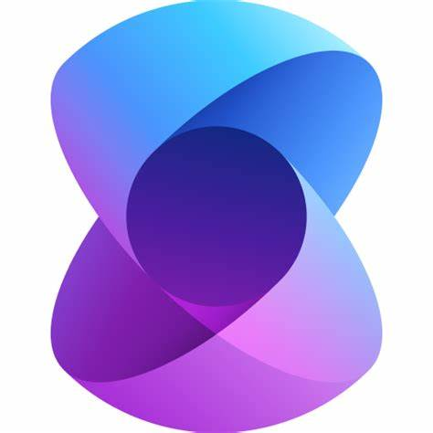

#  Semantic Kernel Worskhop

Bienvenido al repositorio del Taller de Kernel Semántico. Este repositorio contiene laboratorios y materiales de instrucción diseñados para ayudarte a comenzar con 

## Requisitos previos

Antes de comenzar el taller, asegúrate de tener lo siguiente:
- Una cuenta activa de Azure.
- Conocimientos básicos de Markdown y Git.
- Visual Studio Code o cualquier editor de código de tu preferencia.
- [Azure CLI](https://docs.microsoft.com/en-us/cli/azure/install-azure-cli) instalado.
- Familiaridad con los conceptos de computación en la nube.

## Instrucciones

1. **Clona el repositorio**
    - Utiliza Git para clonar el repositorio en tu máquina local.
    - Ejemplo:
      ```
      git clone https://github.com/your-username/semantic-kernel-workshop.git
      ```
2. **Sigue las instrucciones del laboratorio**
    - Las instrucciones detalladas del laboratorio se proporcionan en el repositorio. Comienza revisando el archivo del laboratorio vinculado a continuación.
3. **Ejecuta y prueba**
    - Ejecuta los ejemplos según las instrucciones y verifica que tu entorno de Azure esté configurado correctamente.

## Archivos del Laboratorio

- Accede a los archivos del laboratorio haciendo clic en el siguiente enlace:
  - [Archivos del Laboratorio para los Módulos de Azure AI Vision](/c:/Users/pablocastao/OneDrive%20-%20Microsoft/Work/Clients/bccr/semantic-kernel-workshop/README.md)

¡Feliz aprendizaje y codificación!