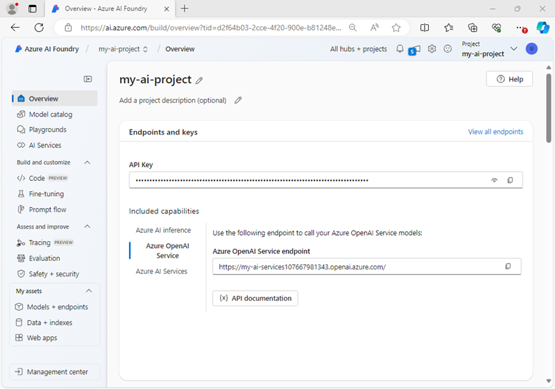
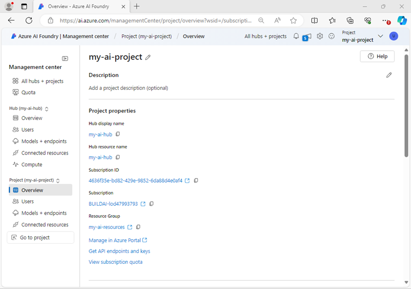
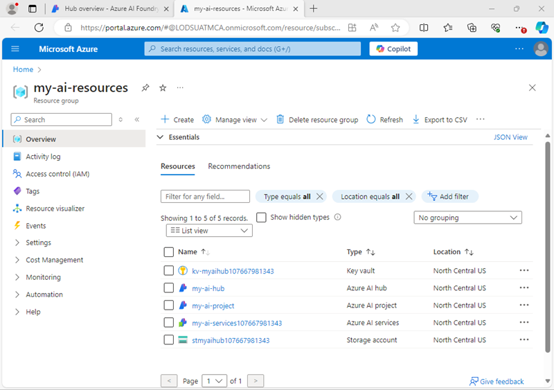
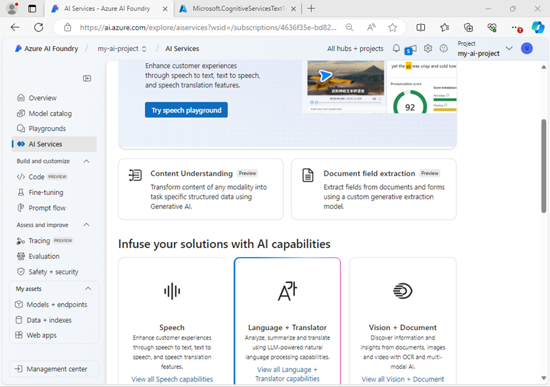
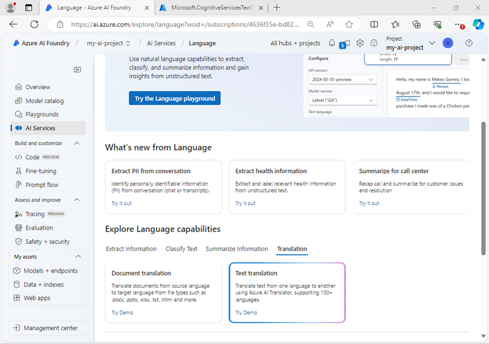
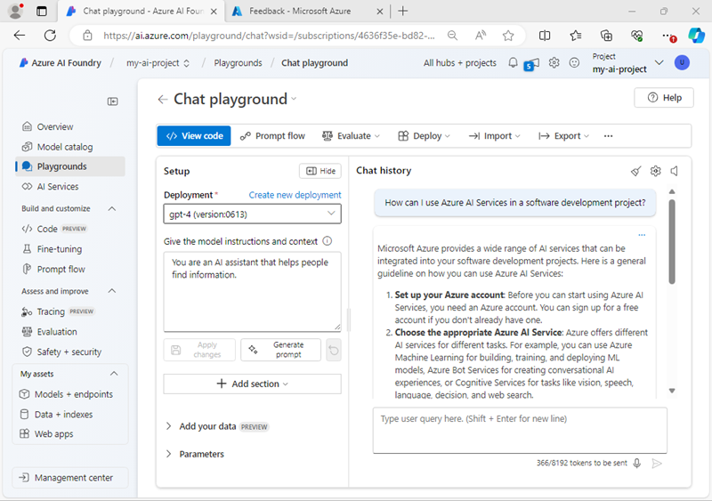

---
lab:
    title: 'Prepara un proyecto de desarrollo de IA'
    description: 'Aprende a organizar recursos en la nube en hubs y proyectos para que los desarrolladores estén preparados para tener éxito al construir soluciones de IA.'
---

# Prepara un proyecto de desarrollo de IA

En este ejercicio, utilizarás el portal Azure AI Foundry para crear un hub y un proyecto, listos para que un equipo de desarrolladores construya una solución de IA.

Este ejercicio dura aproximadamente **30** minutos.

## Abrir el portal Azure AI Foundry

Comencemos iniciando sesión en el portal Azure AI Foundry.

1. En un navegador web, abre el [portal Azure AI Foundry](https://ai.azure.com) en `https://ai.azure.com` e inicia sesión con tus credenciales de Azure. Cierra cualquier sugerencia o panel de inicio rápido que se abra la primera vez que inicies sesión y, si es necesario, utiliza el logo de **Azure AI Foundry** en la parte superior izquierda para navegar a la página de inicio, que se verá similar a la siguiente imagen:

    

1. Revisa la información en la página de inicio.

## Crear un hub y un proyecto

Un *hub* de Azure AI proporciona un espacio de trabajo colaborativo en el que se puede definir uno o más *proyectos*. Vamos a crear un hub y un proyecto y a revisar los recursos de Azure que se crean para soportarlos.

1. En la página de inicio, selecciona **+ Create project**.
1. En el asistente **Create a project**, ingresa un nombre adecuado para el proyecto (por ejemplo, `my-ai-project`) y luego revisa los recursos de Azure que se crearán automáticamente para soportar tu proyecto.
1. Selecciona **Customize** y especifica las siguientes configuraciones para tu hub:
    - **Hub name**: *Un nombre único - por ejemplo, `my-ai-hub`*
    - **Subscription**: *Tu suscripción de Azure*
    - **Resource group**: *Crea un nuevo grupo de recursos con un nombre único (por ejemplo, `my-ai-resources`) o selecciona uno existente*
    - **Location**: Selecciona **Help me choose** y luego elige **gpt-4** en la ventana de ayuda de ubicación y utiliza la región recomendada\*
    - **Connect Azure AI Services or Azure OpenAI**: *Crea un nuevo recurso de AI Services con un nombre apropiado (por ejemplo, `my-ai-services`) o utiliza uno existente*
    - **Connect Azure AI Search**: Omite la conexión

    > \* Los recursos de Azure OpenAI están restringidos a nivel de inquilino por cuotas regionales. En el caso de que se alcance un límite de cuota más adelante en el ejercicio, es posible que necesites crear otro recurso en una región diferente.

1. Selecciona **Next** y revisa tu configuración. Luego, selecciona **Create** y espera a que el proceso se complete.
1. Cuando se haya creado tu proyecto, cierra cualquier sugerencia que se muestre y revisa la página del proyecto en el portal Azure AI Foundry, que se verá similar a la siguiente imagen:

    

1. En la parte inferior del panel de navegación a la izquierda, selecciona **Management center**. El centro de administración es donde puedes configurar ajustes tanto a nivel de *hub* como de *proyecto*, y ambos se muestran en el panel de navegación.

    

    Ten en cuenta que en el panel de navegación, puedes ver y administrar los activos a nivel de hub y proyecto en las siguientes páginas:

    - Overview
    - Users
    - Models and endpoints
    - Connected resources
    - Compute (*solo a nivel de hub*)

    > **Nota**: Dependiendo de los permisos asignados a tu Entra ID en tu inquilino de Azure, es posible que no puedas administrar recursos a nivel de hub.

1. En el panel de navegación, en la sección correspondiente a tu hub, selecciona la página **Overview** para ver los detalles de tu hub.
1. En el panel de **Hub properties**, selecciona el enlace al grupo de recursos asociado con el hub para abrir una nueva pestaña en el navegador y navegar al portal de Azure. Inicia sesión con tus credenciales de Azure si se te solicita.
1. Visualiza el grupo de recursos en el portal de Azure para ver los recursos de Azure que se han creado para soportar tu hub y tu proyecto.

    

    Ten en cuenta que los recursos se han creado en la región que seleccionaste al crear el hub.

## Agregar un recurso conectado

Supongamos que tu proyecto necesita acceso a un segundo recurso **Azure AI Services** en una región diferente.

1. En el portal de Azure, en la página de tu grupo de recursos, selecciona **+ Create** y busca `Azure AI Services`. En los resultados, selecciona el recurso multi-servicio **Azure AI Services** como se muestra en la siguiente imagen:

    

1. Crea un nuevo recurso **Azure AI Services** con las siguientes configuraciones:
    - **Subscription**: *Tu suscripción de Azure*
    - **Resource group**: *El grupo de recursos que contiene tus recursos existentes de Azure AI Foundry*
    - **Region**: *Selecciona cualquier región disponible distinta a aquella que contiene tus recursos existentes*
    - **Name**: *Un nombre único*
    - **Pricing tier**: Standard S0
1. Espera a que se cree el recurso de AI Services.
1. Regresa a la pestaña del navegador del portal Azure AI Foundry y, en la vista del **Management center**, en el panel de navegación, en la sección correspondiente a tu *<u>proyecto</u>*, visualiza la página **Connected resources**. Se listan los recursos conectados existentes en tu proyecto.

    

1. Selecciona **+ New connection** y elige el tipo de recurso **Azure AI Services**. Luego, busca entre los recursos disponibles el recurso de AI Services que creaste en el portal de Azure y utiliza el botón **Add Connection** para agregarlo a tu proyecto.

    

1. Cuando se conecte el nuevo recurso, cierra el cuadro de diálogo **Connect an Azure AI services resources** y verifica que se han listado nuevos recursos conectados para Azure AI Services y Azure OpenAI Service.

## Explorar Azure AI Services

Tu proyecto de Azure AI Foundry tiene acceso a Azure AI Services. Vamos a probarlo en el portal.

1. En la página del Management center, en el panel de navegación, debajo de tu proyecto, selecciona **Go to project**.
1. En el panel de navegación de tu proyecto, selecciona **AI Services** y luego la casilla **Language and Translator**.

    

1. En la sección **Explore Language capabilities**, visualiza la pestaña **Translation** y selecciona **Text translation**.

    

1. En la página **Text translation**, en la sección **Try it out**, selecciona la pestaña **Try with your own**.
1. Selecciona cualquiera de tus recursos de Azure AI Services y luego intenta traducir algún texto (por ejemplo, `Hello world`) de un idioma a otro.

    

## Desplegar y probar un modelo de IA generativa

Tu proyecto también contiene recursos conectados para Azure OpenAI, lo que te permite utilizar modelos de lenguaje de Azure OpenAI para implementar soluciones de IA generativa.

1. En el panel de la izquierda de tu proyecto, en la sección **My assets**, selecciona la página **Models + endpoints**.
1. En la página **Models + endpoints**, en la pestaña **Model deployments**, en el menú **+ Deploy model**, selecciona **Deploy base model**.
1. Busca el modelo **gpt-4** en la lista, y luego selecciónalo y confírmalo.
1. Despliega el modelo con las siguientes configuraciones seleccionando **Customize** en los detalles del despliegue:
    - **Deployment name**: *Un nombre único para el despliegue de tu modelo, por ejemplo, `gpt-4-model`*
    - **Deployment type**: Standard
    - **Model version**: *Selecciona la versión por defecto*
    - **Connected AI resource**: *Selecciona cualquiera de tus conexiones de recursos de Azure OpenAI*
    - **Tokens per Minute Rate Limit (thousands)**: 5K
    - **Content filter**: DefaultV2
    - **Enable dynamic quota**: Disabled
      
    > **Nota**: Reducir la tasa TPM ayuda a evitar el sobreuso de la cuota disponible en la suscripción que estás utilizando. 5,000 TPM es suficiente para los datos utilizados en este ejercicio.

1. Después de que el modelo se haya desplegado, en la página de vista general del despliegue, selecciona **Open in playground**.
1. En la página **Chat playground**, asegúrate de que tu despliegue de modelo esté seleccionado en la sección **Deployment**.
1. En la ventana de chat, ingresa una consulta como `How can I use Azure AI Services in a software development project?` y revisa la respuesta:

    

## Resumen

En este ejercicio, has explorado Azure AI Foundry y aprendido a crear y administrar hubs y proyectos, agregar recursos conectados y explorar tanto Azure AI Services como modelos de Azure OpenAI en el portal Azure AI Foundry.

## Limpieza

Si has terminado de explorar el portal Azure AI Foundry, deberías eliminar los recursos que creaste en este ejercicio para evitar incurrir en costos innecesarios de Azure.

1. Regresa a la pestaña del navegador que contiene el portal de Azure (o vuelve a abrir el [portal de Azure](https://portal.azure.com) en una nueva pestaña) y visualiza el contenido del grupo de recursos donde desplegaste los recursos utilizados en este ejercicio.
1. En la barra de herramientas, selecciona **Delete resource group**.
1. Ingresa el nombre del grupo de recursos y confirma que deseas eliminarlo.