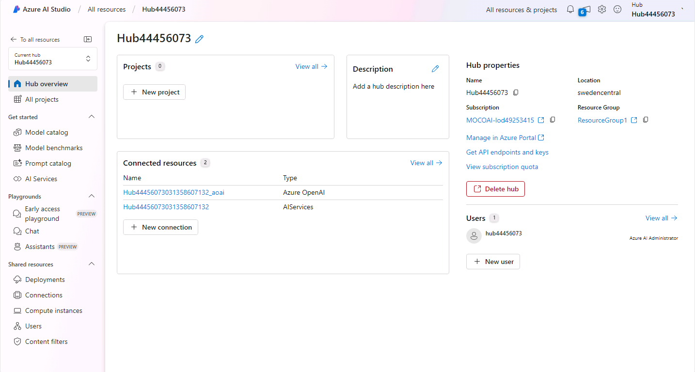

---
lab:
    title: 'Elija y despliegue un modelo de lenguaje'
    description: 'Las aplicaciones de IA generativa se basan en uno o más modelos de lenguaje. Aprende a encontrar y seleccionar los modelos adecuados para tu proyecto de IA generativa.'
---

# Elija y despliegue un modelo de lenguaje

El catálogo de modelos de Azure AI Foundry sirve como un repositorio central donde puedes explorar y utilizar una variedad de modelos, facilitando la creación de tu escenario de IA generativa.

En este ejercicio, explorarás el catálogo de modelos en el portal de Azure AI Foundry.

Este ejercicio tomará aproximadamente **25** minutos.

## Crea un hub y proyecto de Azure AI

Un hub de Azure AI proporciona un espacio de trabajo colaborativo en el que puedes definir uno o más *proyectos*. Vamos a crear un proyecto y un hub de Azure AI.

1. En un navegador web, abre el [portal de Azure AI Foundry](https://ai.azure.com) en `https://ai.azure.com` e inicia sesión utilizando tus credenciales de Azure.

2. En la página de inicio, selecciona **+ Crear proyecto**. En el asistente **Crear un proyecto** podrás ver todos los recursos de Azure que se crearán automáticamente con tu proyecto, o bien puedes personalizar la siguiente configuración seleccionando **Personalizar** antes de hacer clic en **Crear**:

    - **Nombre del hub**: *Un nombre único*
    - **Suscripción**: *Tu suscripción de Azure*
    - **Grupo de recursos**: *Un nuevo grupo de recursos*
    - **Ubicación**: Selecciona **Ayúdame a elegir** y luego selecciona **gpt-35-turbo** en la ventana auxiliar de Ubicación y usa la región recomendada\*
    - **Conectar Azure AI Services o Azure OpenAI**: (Nuevo) *Se completa automáticamente con el nombre de tu hub seleccionado*
    - **Conectar Azure AI Search**: Omitir la conexión

    > \* Los recursos de Azure OpenAI están restringidos a nivel de inquilino por cuotas regionales. Las regiones listadas en el asistente de ubicación incluyen la cuota predeterminada para el/los tipo(s) de modelo(s) utilizados en este ejercicio. Elegir una región al azar reduce el riesgo de alcanzar el límite de cuota en una sola región. En caso de que se alcance el límite de cuota más adelante en el ejercicio, es posible que tengas que crear otro recurso en una región diferente. Más información en [disponibilidad de modelos por región](https://learn.microsoft.com/azure/ai-services/openai/concepts/models#gpt-35-turbo-model-availability)

3. Si seleccionaste **Personalizar**, haz clic en **Siguiente** y revisa tu configuración.
4. Selecciona **Crear** y espera a que el proceso finalice.
   
   Después de que se hayan creado el hub y el proyecto de Azure AI, se verán similares a la siguiente imagen:

    

5. Abre una nueva pestaña en el navegador (dejando abierta la pestaña del portal de Azure AI Foundry) y navega hasta el portal de Azure en [https://portal.azure.com](https://portal.azure.com?azure-portal=true), iniciando sesión con tus credenciales de Azure si se te solicita.
6. Navega hasta el grupo de recursos donde creaste tu hub de Azure AI y visualiza los recursos de Azure que se han creado.

    

7. Regresa a la pestaña del navegador donde tienes abierto el portal de Azure AI Foundry.
8. Explora cada una de las páginas en el panel a la izquierda de la página de tu hub de Azure AI y toma nota de los artefactos que puedes crear y administrar. En la página del **Centro de gestión**, puedes seleccionar **Recursos conectados**, ya sea bajo tu hub o tu proyecto, y observar que ya se han creado las conexiones a Azure OpenAI y servicios de IA.
9. Si estás en la página del Centro de gestión, selecciona **Ir al proyecto**.

## Elige un modelo utilizando análisis comparativos de modelos

Antes de desplegar un modelo, puedes explorar los análisis comparativos para decidir cuál modelo se adapta mejor a tus necesidades.

Imagina que deseas crear un copilot personalizado que sirva como asistente de viajes. Específicamente, quieres que tu copilot ofrezca soporte para consultas relacionadas con viajes, como requisitos de visa, pronósticos del clima, atracciones locales y normas culturales.

Tu copilot necesitará proporcionar información fácticamente exacta, por lo que la solidez es importante. Además, deseas que las respuestas del copilot sean fáciles de leer y comprender. Por ello, también querrás elegir un modelo que puntúe alto en fluidez y coherencia.

1. En el portal del proyecto de Azure AI Foundry, navega a **Catálogo de modelos** usando el menú a la izquierda.
    En la página del catálogo, selecciona **Comparar con análisis comparativos**. En la página de análisis comparativos de modelos, encontrarás un gráfico ya trazado que compara diferentes modelos.
2. Selecciona **+ Modelo para comparar** y añade **gpt-4o** y **gpt-35-turbo** al gráfico de métricas. En el menú desplegable **Eje X**, bajo **Calidad**, selecciona las siguientes métricas y observa cada gráfico resultante antes de cambiar a la siguiente:
    - Coherencia
    - Fluidez
    - Solidez
3. Al explorar los resultados, puedes intentar responder las siguientes preguntas:
    - ¿Notas alguna diferencia en el rendimiento entre los modelos GPT-3.5 y GPT-4o?
    - ¿Existe una diferencia entre las versiones del mismo modelo?

De la colección de Azure OpenAI, puedes elegir entre los modelos GPT-3.5 y GPT-4o. Despleguemos estos dos modelos y exploremos cómo se comparan para tu caso de uso.

## Despliega modelos de Azure OpenAI

Ahora que has explorado tus opciones a través de los análisis comparativos, estás listo para desplegar modelos de lenguaje. Puedes explorar el catálogo de modelos y desplegar desde ahí, o puedes desplegar un modelo a través de la página de **Implementaciones**. Exploremos ambas opciones.

### Desplegar un modelo desde el Catálogo de modelos

Comencemos desplegando un modelo desde el Catálogo de modelos. Puede que prefieras esta opción cuando quieras filtrar entre todos los modelos disponibles.

1. Navega a la página del **Catálogo de modelos** usando el menú a la izquierda.
2. Busca y despliega el modelo `gpt-4o`, curado por Azure AI, con la siguiente configuración al seleccionar **Personalizar** en los detalles del despliegue:
   
    - **Nombre del despliegue**: *Un nombre único para tu despliegue de modelo*
    - **Tipo de despliegue**: Estándar
    - **Versión del modelo**: *Selecciona la versión predeterminada*
    - **Recurso de IA**: *Selecciona el recurso creado previamente*
    - **Límite de tokens por minuto (millares)**: 150K
    - **Filtro de contenido**: DefaultV2
    - **Habilitar cuota dinámica**: Deshabilitado

    > **Nota**: Si la ubicación actual de tu recurso de IA no tiene cuota disponible para el modelo que deseas desplegar, se te pedirá seleccionar una ubicación diferente en la que se creará un nuevo recurso de IA y se conectará a tu proyecto.

### Desplegar un modelo a través de Models + endpoints

Si ya sabes exactamente qué modelo deseas desplegar, puedes hacerlo a través de **Models + endpoints**.

1. Navega a la página **Models + endpoints** en la sección **Mis activos**, usando el menú a la izquierda.
2. En la pestaña **Despliegues de modelos**, despliega un nuevo modelo base con la siguiente configuración al seleccionar **Personalizar** en los detalles del despliegue:
    - **Modelo**: gpt-4
    - **Nombre del despliegue**: *Un nombre único para tu despliegue de modelo*
    - **Tipo de despliegue**: Estándar
    - **Versión del modelo**: *Selecciona la versión predeterminada*
    - **Recurso de IA**: *Selecciona el recurso creado previamente*
    - **Límite de tokens por minuto (millares)**: 5K
    - **Filtro de contenido**: DefaultV2
    - **Habilitar cuota dinámica**: Deshabilitado

## Prueba tus modelos en el chat de pruebas

Ahora que tenemos dos modelos para comparar, veamos cómo se comportan en una interacción conversacional.

1. Navega a la página de **Playgrounds** usando el menú a la izquierda.
2. En el **Chat Playground**, selecciona tu despliegue de GPT-4o.
3. En la ventana de chat, ingresa la consulta `What can you do?` y observa la respuesta.
    Las respuestas son muy genéricas. Recuerda que queremos crear un copilot personalizado que funcione como asistente de viajes. Puedes especificar el tipo de ayuda que deseas en la pregunta.
4. En la ventana de chat, ingresa la consulta `Imagine you're a travel assistant, what can you help me with?`
    Las respuestas ya son más específicas. Quizás no quieras que los usuarios finales tengan que proporcionar el contexto necesario cada vez que interactúan con tu copilot. Para añadir instrucciones globales, puedes editar el mensaje del sistema.
5. En **Configuración**, actualiza el campo **Proporciona instrucciones y contexto al modelo** con el siguiente mensaje:

   ```
   Eres un asistente de viajes con IA que ayuda a las personas a planificar sus viajes. Tu objetivo es ofrecer soporte para consultas relacionadas con viajes, como requisitos de visa, pronósticos del clima, atracciones locales y normas culturales.
   ```

6. Selecciona **Aplicar cambios**.
7. En la ventana de chat, ingresa la consulta `What can you do?` y observa la nueva respuesta. Nota cómo ahora es específica para viajes.
8. Continúa la conversación preguntando: `I'm planning a trip to London, what can I do there?`
    El copilot ofrece mucha información relacionada con viajes. Es posible que desees mejorar la respuesta; por ejemplo, podrías querer que la respuesta sea más sucinta.
9. Actualiza el mensaje del sistema añadiendo `Answer with a maximum of two sentences.` al final del mensaje. Aplica el cambio, limpia el chat, y vuelve a probar ingresando: `I'm planning a trip to London, what can I do there?`
    También podrías querer que tu copilot continúe la conversación en lugar de limitarse a responder la pregunta.
10. Actualiza el contexto del modelo añadiendo `End your answer with a follow-up question.` al final del mensaje. Guarda el cambio y vuelve a probar el chat ingresando: `I'm planning a trip to London, what can I do there?`
11. Cambia tu **Despliegue** a tu modelo GPT-4 y repite todos los pasos de esta sección. Observa cómo los modelos pueden variar en sus respuestas.
12. Finalmente, prueba ambos modelos con la consulta `Who is the prime minister of the UK?`. El rendimiento en esta pregunta está relacionado con la solidez (si la respuesta es fácticamente precisa) de los modelos. ¿Se correlaciona el rendimiento con tus conclusiones de los análisis comparativos?

Ahora que has explorado ambos modelos, reflexiona sobre cuál modelo elegirías para tu caso de uso. Al principio, las respuestas de los modelos pueden diferir y podrías preferir uno sobre el otro. Sin embargo, después de actualizar el mensaje del sistema, es posible que notes que la diferencia es mínima. Desde la perspectiva de la optimización de costos, podrías optar por el modelo GPT-3.5 en lugar del GPT-4, ya que su rendimiento es muy similar.

## Limpieza

Si has terminado de explorar el portal de Azure AI Foundry, deberías eliminar los recursos que creaste en este ejercicio para evitar incurrir en costos innecesarios de Azure.

1. Regresa a la pestaña del navegador que contiene el portal de Azure (o reabre el [portal de Azure](https://portal.azure.com?azure-portal=true) en una nueva pestaña) y visualiza el contenido del grupo de recursos en el que desplegaste los recursos utilizados en este ejercicio.
2. En la barra de herramientas, selecciona **Eliminar grupo de recursos**.
3. Ingresa el nombre del grupo de recursos y confirma que deseas eliminarlo.