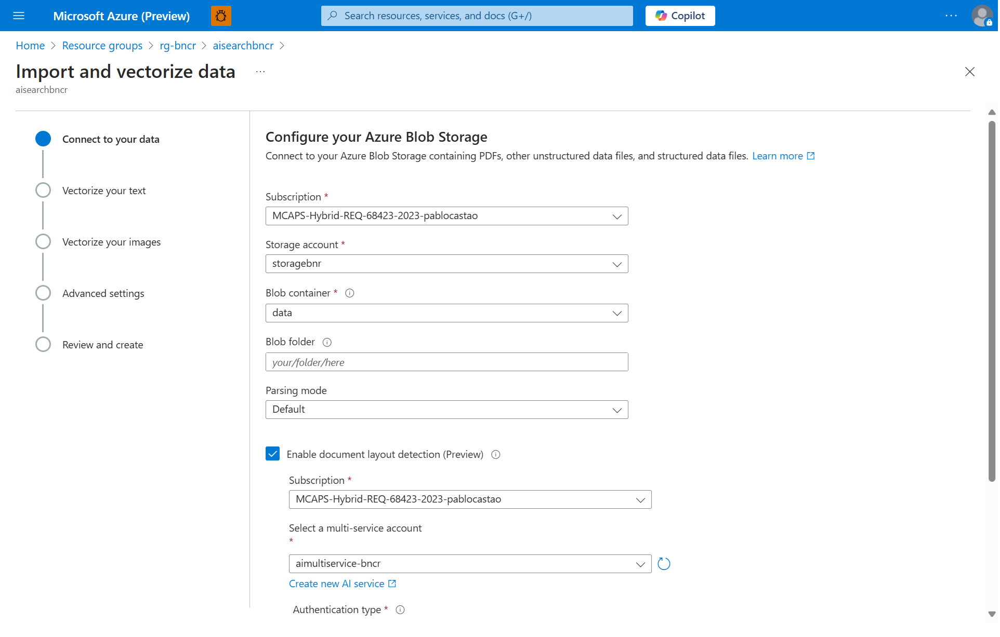
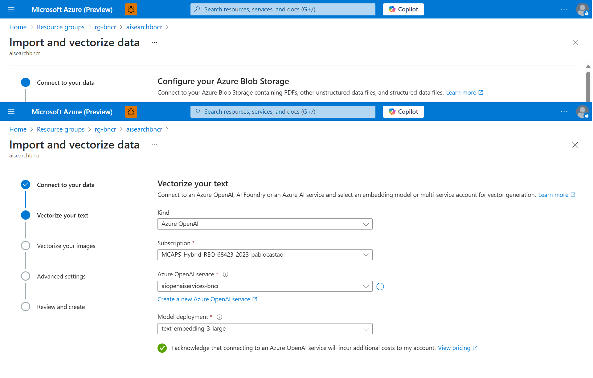
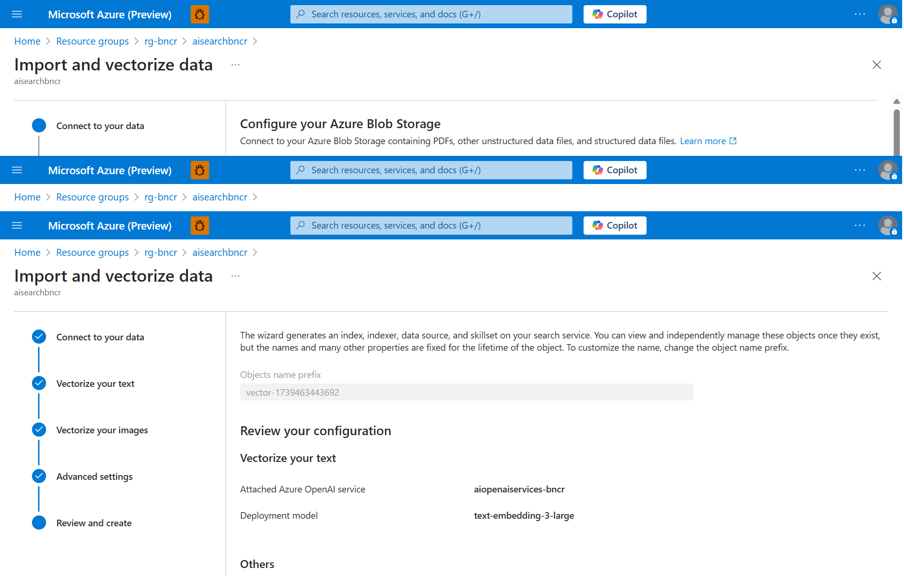
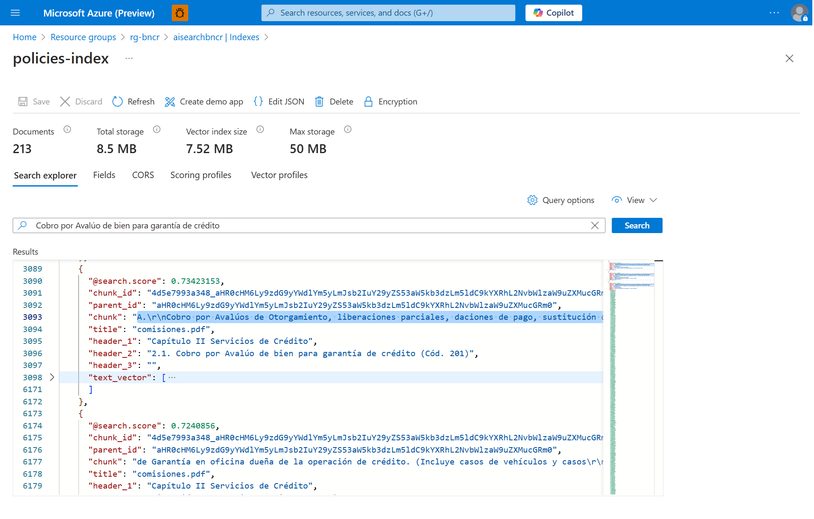

---
lab:
    title: 'Crear una aplicación de IA generativa que utiliza tus propios datos'
    description: 'Aprende cómo utilizar el modelo Retrieval Augmented Generation (RAG) para construir una aplicación de chat que base las solicitudes en tus propios datos.'
---

# Crear una aplicación de IA generativa que utiliza tus propios datos

Retrieval Augmented Generation (RAG) es una técnica utilizada para construir aplicaciones que integran datos de fuentes personalizadas en una solicitud para un modelo de IA generativa. RAG es un patrón común para desarrollar aplicaciones de IA generativa: aplicaciones de chat que utilizan un modelo de lenguaje para interpretar las entradas y generar respuestas apropiadas.

En este ejercicio, utilizarás el portal Azure AI Foundry para integrar datos personalizados en un flujo de solicitud de IA generativa.

Este ejercicio toma aproximadamente **45** minutos.

## Crear un recurso de Azure AI Search

La solución de tu aplicación de IA generativa integrará datos personalizados en un flujo de solicitud. Para apoyar esta integración, necesitarás un recurso de Azure AI Search con el que indexar tus datos.

1. En un navegador web, abre el [portal de Azure](https://portal.azure.com) en `https://portal.azure.com` e inicia sesión con tus credenciales de Azure.
2. En la página principal, selecciona **+ Crear un recurso** y busca `Azure AI Search`. Luego, crea un nuevo recurso de Azure AI Search con la siguiente configuración:

    - **Subscription**: *Selecciona tu suscripción de Azure*
    - **Resource group**: *Selecciona o crea un grupo de recursos*
    - **Service name**: *Ingresa un nombre de servicio único*
    - **Location**: *Haz una elección **aleatoria** entre alguna de las siguientes regiones*\*
        - Australia East
        - Canada East
        - East US
        - East US 2
        - France Central
        - Japan East
        - North Central US
        - Sweden Central
        - Switzerland 
    - **Pricing tier**: Basic

3. Espera a que se complete el despliegue de tu recurso de Azure AI Search.

## Crear un proyecto de Azure OpenAI Service

Ahora estás listo para crear un recurso en Azure OpenAI Service 

1. En un navegador web, abre [Azure OpenAI Service](https://portal.azure.com) e inicia sesión con tus credenciales de Azure.
2. En la página principal, selecciona **+ Create a resource**.
3. En el asistente crea un recurso de **Azure OpenAI** y personaliza:
    - **Subscription**: *Tu suscripción de Azure*
    - **Resource group**: *Selecciona el grupo de recursos que contiene tu recurso de Azure OpenAI*
    - **Location**: *Selecciona la region de tu recurso*
    - **Name**: (Nuevo) *Nombre del recurso*
    - **Pricing Tear**: *Standard SO*
4. Selecciona **Siguiente** y revisa tu configuración.
5. Selecciona **Crear** y espera a que el proceso se complete.

## Desplegar modelos

Necesitas dos modelos para implementar tu solución:

- Un modelo de *embedding* para vectorizar datos de texto y facilitar una indexación eficiente.
- Un modelo que pueda generar respuestas en lenguaje natural basadas en tus datos.

1. En el portal Azure OpenAI Service, selecciona la página **Go to AzureAI Foundry Portal**.
2. Selecciona **Deployments**
3. Crea un nuevo despliegue del modelo **text-embedding-3-large** con la siguiente configuración, seleccionando **Personalizar** en el asistente de despliegue:
    - **Deployment name**: `text-embedding-3-large`
    - **Deployment type**: Standard
    - **Model version**: *Selecciona la versión predeterminada*
    - **Recurso de OpenAI**: *Selecciona el recurso creado previamente*
    - **Tokens per Minute Rate Limit (thousands)**: 150K
    - **Content filter**: DefaultV2
    - **Enable dynamic quota**: Disabled

    > Nota: Si la ubicación de tu recurso actual no tiene cuota disponible para el modelo que deseas desplegar, se te solicitará elegir una ubicación diferente donde se creará un nuevo recurso y se conectará a tu proyecto.

4. Repite los pasos anteriores para desplegar un modelo **gpt-4o-2024-11-20** con el nombre de despliegue `gpt-4o`.

    > Nota: Reducir los tokens por minuto (TPM) ayuda a evitar el sobreuso de la cuota disponible en tu suscripción. 150.000 TPM es suficiente para los datos utilizados en este ejercicio.

## Crear um almacenamento para nuestros datos

### 1. Acceder al portal de Azure
- Ve a https://portal.azure.com e inicia sesión con tus credenciales.

### 2. Crear una nueva cuenta de almacenamiento
- Haz clic en "Crear un recurso".
- Selecciona "Almacenamiento" y luego "Storage accounts".
- Presiona el boton crear

  - **Subscription**: *Selecciona tu suscripción de Azure*
    - **Resource group**: *Selecciona o crea un grupo de recursos*
    - **Storage account name**: *Ingresa un nombre de servicio único*
    - **Location**: *Haz una elección **aleatoria** entre alguna de las siguientes regiones*\*
        - Australia East
        - Canada East
        - East US
        - East US 2
        - France Central
        - Japan East
        - North Central US
        - Sweden Central
        - Switzerland 
    - **Primary service**: Azure Blob Storage

- Dentro del recurso de Almacenamiento, crear un Container llamado `data`
    - Data Storage -> Containers -> + Container

## Crear un índice para tus datos

Ahora vamos a crear un índice en tu recurso de Azure AI Search.
Ingresa al recurso de Azure AI Search.

1. Seleccione **Import and Vectorize data**

2. Conectarse a los datos
 

3. Vectorizar 
 

4. Revisar y Crear
 

## Probar el índice

Ahora vamos a probar el índice creado dentro del recurso de Azure AI Search
Ingresa al recurso de Azure AI Search.

1. Selecciona **Search Management**, **Indexes**  y accede al indice creado

2. En la barra **Search** escribe: `Cobro por Avalúo de bien para garantía de crédito` 

 
