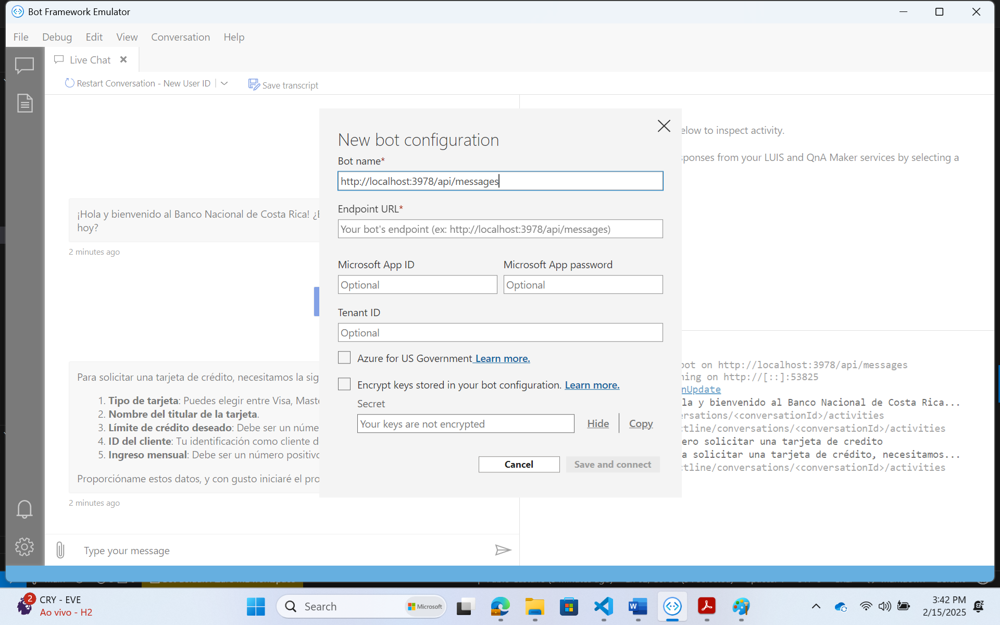
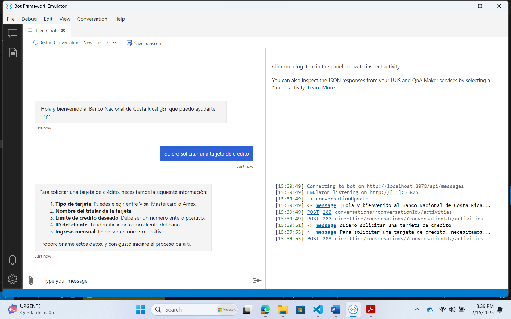

---
lab:
    title: 'Crear un bot usando Semantic Kernel'
    description: 'Aprende cómo crear un Agente de Semantic Kernel con Plugins Nativos'
    time: '120 min'
---

# Descripción
Este ejemplo proporciona una plantilla y una guía sobre cómo desplegar un asistente virtual usando Semantic Kernel aprovechando múltiples tecnologías de Azure AI. Cubre:
- el despliegue de la infraestructura 
- creacion de data fake
- creacion del agente usando Semantic Kernel
- ejecucion del bot (ambiente local usando Bot Emulator)

# Prerequisitos
- [Python 3.11 or later version](https://www.python.org/) installed (recommended to use a separate python environment for this lab)
- [VS Code](https://code.visualstudio.com/) installed with the [Jupyter notebook extension](https://marketplace.visualstudio.com/items?itemName=ms-toolsai.jupyter) enabled
- [Azure CLI](https://learn.microsoft.com/cli/azure/install-azure-cli) installed
- [An Azure Subscription](https://azure.microsoft.com/free/) with Contributor permissions
- [Access granted to Azure OpenAI](https://aka.ms/oai/access) or just enable the mock service
- [Sign in to Azure with Azure CLI](https://learn.microsoft.com/cli/azure/authenticate-azure-cli-interactively)
- [Bot Emulator](https://learn.microsoft.com/en-us/azure/bot-service/bot-service-debug-emulator?view=azure-bot-service-4.0&tabs=csharp)

## [Crear Infrastructura](../lab/chat-app/infra/set_up.ipynb)

1. Python
```bash
# Set up a virtualenv / conda environment and activate it
cd lab/chat-app/python
pip install -r requirements.txt 
```

2. Ejecutar el [notebook](../lab/chat-app/infra/set_up.ipynb)

3. Adicionar las variables de ambiente con los recursos creados en [.sample-env](./lab/chat-app/python/.sample-env). Renombrar el archivo de .sample-env a .env


## [Indexar documentos en AI Search y Cargar datos fake transaccionales en Postgres](../lab/chat-app/data/load.ipynb)

1. Ejecutar el [notebook](../lab/chat-app/data/load.ipynb)


## [Crear el bot usando Semantic Kernel](../lab/chat-app/data/load.ipynb)

1. [Crear los plugins](../lab/chat-app/python/plugins/)<br>
Explore los plugins:
    - [Buscar en documentos indexados](../lab/chat-app/python/plugins/Search)
    - [Buscar en un banco transaccional](../lab/chat-app/python/plugins/DebitAccount)
    - [Consumir una API externa](../lab/chat-app/python/plugins/CreditCard)

2. [Adicionar un nuevo plugin](../lab/chat-app/python/plugins/Recommend)
- Vamos a redactar un plugin semantico para recomendar productos financieros.
- En el archivo [skprompt.txt](../lab/semantickernel/python/plugins/Recommend/skprompt.txt) , por favor redacta un prompt que utilice los parámetros "producto", "perfil_de_riesgo" y "personalizado" para recomendar un producto financiero al cliente. Asegúrate de que el prompt:
    - Incorpore el parámetro "producto", seleccionando de las opciones enumeradas.
    - Refleje el "perfil_de_riesgo" del cliente (conservador, moderado o agresivo).
    - Incluya detalles relevantes del parámetro "personalizado" para personalizar la recomendación.
    - Cumpla con el objetivo descrito en la "description": "Recomienda un producto financiero para el cliente".
    - El prompt debe ser claro y proporcionar contexto suficiente para generar una recomendación adecuada basada en los parámetros especificados.


2. [Adicionar servicio de chat](../lab/chat-app/python/bot/semantic_kernel_bot.py) 
- Adicione un servicio `AzureChatCompletion` al kernel
```python 
# semantic_kernel_bot.py
 # 3.Add Azure Chat service 
```

3. [Crear agente con los plugins](../lab/chat-app/python/bot/semantic_kernel_bot.py)
- Crear un agente  `ChatCompletionAgent`
```python 
# semantic_kernel_bot.py
 # 6. Add ChatCompletionAgent
```

4. [Editar las instrucciones del agente](../lab/chat-app/python/bot/instructions.jinja)
- Editar las instrucciones del agente para adicionar el plugin creado antes
```text
# instructions.jinja
## Role  
   
Eres un asistente de inteligencia artificial que trabaja dentro de un banco. 
Tu función es ayudar a los usuarios proporcionando información precisa y útil en respuesta a sus consultas. Tienes acceso a dos herramientas para apoyarte en tus respuestas:  
   
- **query_index**:  Te proporciona acceso a datos internos de la empresa, como documentos, políticas, procedimientos y registros operativos.  
- **get_balance**:  Te proporciona acceso a consultar saldo del usuario en la fecha de hoy
- **request_credit_card**: Te proporciona acceso a solicitar una tarjeta de credito
- **get_credit_card_requirements**: Te proporciona los datos requeridos para solicitar una tarjeta de credito

```

5. [Ejecutar la app](../lab/chat-app/python/app.py)
```bash
source .venv/Scripts/Activate
python lab/chat-app/python/app.py
```

- Conecta el emulador de bot a http://localhost:3978/api/messages, completando el campo Bot Url como se muestra a continuación:


- ¡Chatea con tu nuevo bot!



<a id='clean'></a>
### 🗑️ Limpiar recursos

Cuando hayas terminado con el laboratorio, debes eliminar todos los recursos desplegados en Azure para evitar cargos adicionales y mantener tu suscripción de Azure organizada.  
Utiliza el [clean-up-resources notebook](../lab/chat-app/infra/clean-up-resources.ipynb) para ello.

